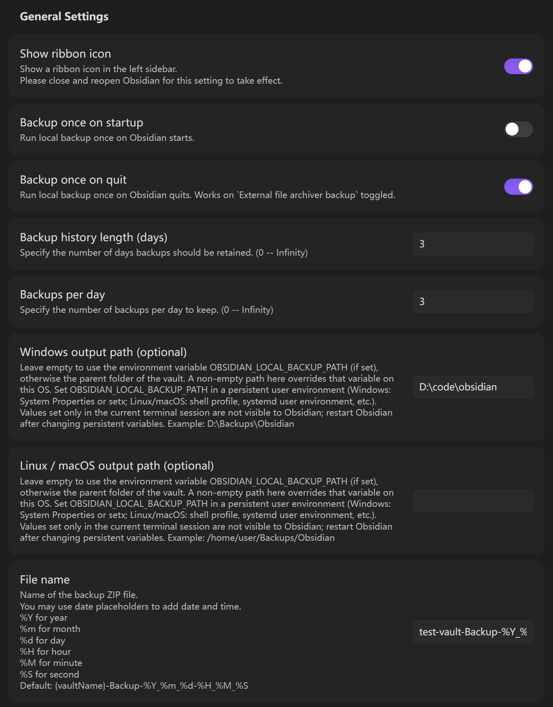
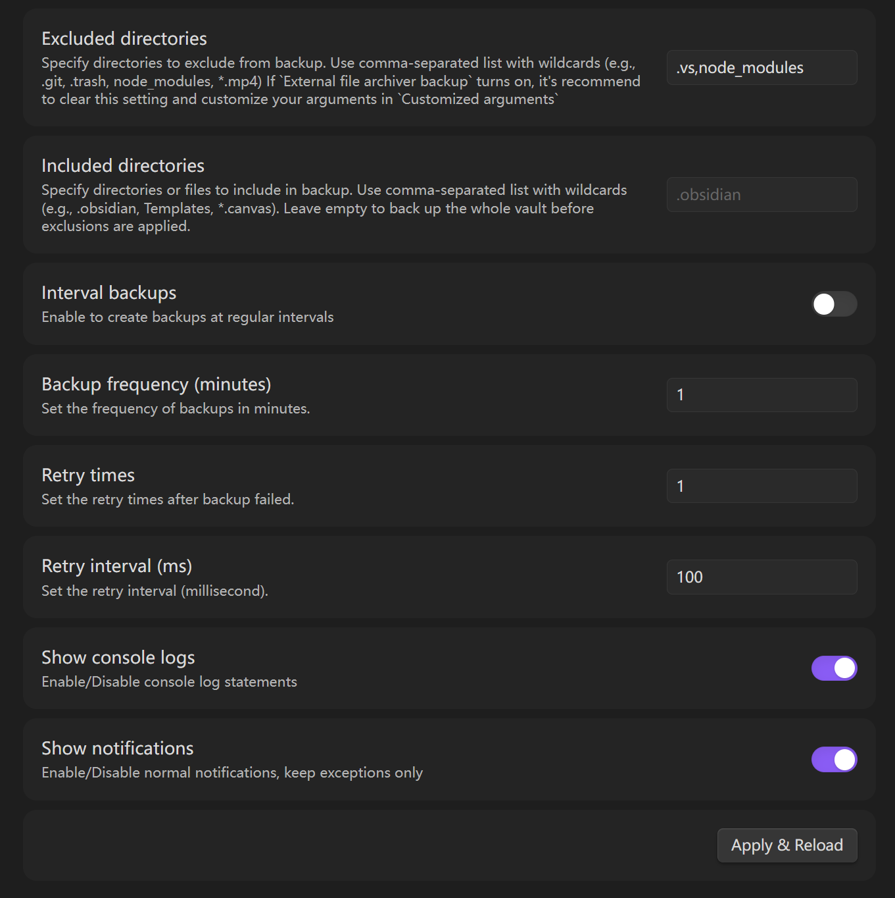
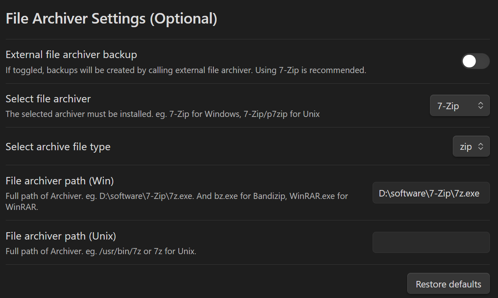
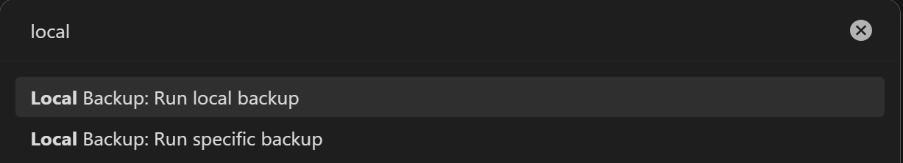
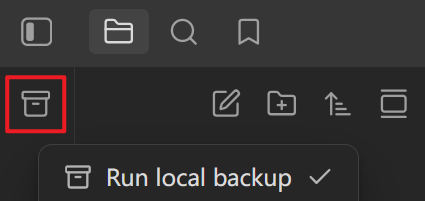

# Local Backup

[English](README.md)

自动为 Obsidian 仓库创建本地备份。

## 功能特性

- 启动时备份
- 退出时备份
- 可配置备份保留周期
- 可自定义输出路径
- 支持定时备份
- 支持调用外部压缩器进行备份（7-Zip、WinRAR、Bandizip）
- 失败后自动重试
- 支持创建指定名称的备份文件
- 支持通过通配符忽略目录和文件
- 支持通过通配符只备份指定目录和文件

## 使用方法

### 插件设置

#### 常规设置

##### 提示

1. 请根据你的操作系统设置输出路径。
2. 如果你会在 Windows 和 Unix 系统之间切换使用，请分别配置这两个输出路径。
3. `Included directories` 和 `Excluded directories` 都使用逗号分隔，并支持相同的通配符匹配规则。
4. 如果 `Included directories` 为空，则会先备份整个仓库，再应用排除规则。
5. 如果设置了 `Included directories`，则只会备份命中的目录和文件，然后再用 `Excluded directories` 从结果中继续剔除。

> *如果你开启定时备份，建议设置一个合理的频率，例如不少于 10 分钟。这个插件会消耗 CPU 和磁盘 I/O 资源，过于频繁的备份可能导致卡顿。*

##### 包含与排除示例

- 只备份 Obsidian 配置目录：将 `Included directories` 设置为 `.obsidian`
- 只备份部分内容：将 `Included directories` 设置为 `.obsidian, Templates, *.canvas`
- 备份整个仓库但排除部分路径：将 `Included directories` 留空，并将 `Excluded directories` 设置为 `.git, .trash, node_modules, *.mp4`
- 组合使用包含与排除：将 `Included directories` 设置为 `.obsidian, Templates`，并将 `Excluded directories` 设置为 `workspace.json`

#### 文件压缩设置（可选）

##### 提示

1. （实验性功能）如果你的仓库很大，备份时 Obsidian 会卡住，可以尝试在设置页面启用这个实验性功能。

> *如果你的仓库体积较大，建议在设置页面启用 `External file archiver backup`，也就是最新版本中的实验性功能，然后继续完成压缩器相关设置。*

### 运行本地备份命令

#### 命令面板

使用 `Ctrl + P` 打开命令面板。

#### 创建特定备份

如上面的命令面板截图所示，如果你想长期保留某个备份文件，可以创建一个指定名称的备份。通过这个命令创建的文件不会被插件自动删除。但你需要确保它和 `File name` 设置不同。例如：`File name` 为 `dev-Backup-%Y_%m_%d-%H_%M_%S`，那么你手动输入的特定文件名就不要使用同样的格式。

#### 侧边栏图标

点击侧边栏图标。

## 安装

### 从插件市场安装

- 在 Obsidian Community Plugins 中搜索 `Local Backup` 并安装
- 启用 `Local Backup`
- 按照 [使用方法](#使用方法) 配置 `Local Backup`
- 应用设置或重启 Obsidian
- 开始使用

### 手动安装插件

- 将 `main.js`、`styles.css`、`manifest.json` 复制到你的仓库目录 `VaultFolder/.obsidian/plugins/your-plugin-id/`
- 打开 Obsidian 并启用 `Local Backup`
- 按照上面的 [从插件市场安装](#从插件市场安装) 指引继续操作

## 参与贡献

### 构建

**欢迎代码贡献，直接向 master 分支发起 PR 即可 :)**

- 克隆这个仓库
- 确保你的 NodeJS 至少是 v16（`node --version`）
- 运行 `npm i` 或 `yarn` 安装依赖
- 运行 `npm run dev` 启动监听模式编译
- 运行 `npm run build` 构建 `./build` 中的 `main.js`

## 参考

- [adm-zip](https://github.com/cthackers/adm-zip)
- [7-Zip](https://www.7-zip.org/)
- [WinRAR](https://www.win-rar.com/)
- [Bandizip](https://www.bandisoft.com/)

## 赞助这个项目

如果这个插件帮你节省了时间，也欢迎请作者喝杯咖啡。

https://paypal.me/gris0297

## 许可证

**Obsidian Local Backup** 基于 MIT 协议发布。更多信息请参阅 [LICENSE](https://github.com/cgcel/obsidian-local-backup/blob/master/LICENSE)。
